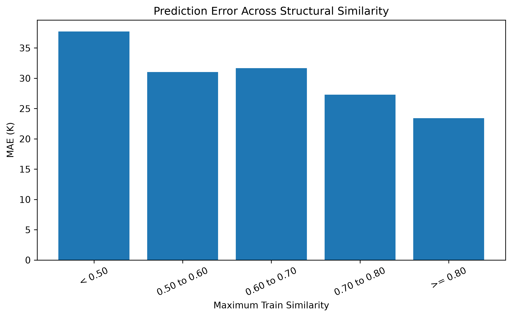

# Polymer Tg Prediction with XGBoost, SHAP and Applicability Domain

> 基于聚合物分子结构描述符预测玻璃化转变温度（Tg），并进一步分析模型可解释性、化学空间泛化能力及适用域。

## 项目简介

玻璃化转变温度（Tg）是聚合物的重要性能指标，与分子链刚性、环结构、可旋转键以及分子间作用力等结构因素密切相关。

本项目基于 **7,367 个聚合物样本和 99 个分子结构描述符**建立 Tg 预测模型。相比只关注模型在随机划分数据集上的预测精度，本项目进一步关注两个实际问题：

- 模型为什么会做出这样的预测？
- 面对与训练集结构差异较大的新聚合物时，预测结果还能不能信？

因此，项目在 XGBoost 建模的基础上，引入 SHAP 进行结构–性能关系解释，并结合 Morgan fingerprint、Butina clustering 和 Tanimoto similarity，对模型在不同化学空间下的泛化能力和 Applicability Domain 进行分析。

---

## 核心结果

| Evaluation | R² | MAE (K) | RMSE (K) |
|---|---:|---:|---:|
| Linear Regression | 0.7688 | 40.28 | 54.09 |
| Random Forest | 0.8729 | 27.41 | 40.10 |
| Baseline XGBoost | 0.8835 | 25.86 | 38.40 |
| **Optimized XGBoost** | **0.8878** | **25.16** | **37.69** |
| **Structure-aware Split** | **0.8579** | **30.79** | **42.31** |
| Tanimoto < 0.60 | 0.8134 | 33.39 | 45.96 |
| Tanimoto < 0.40 | 0.6012 | 50.88 | 66.52 |

5-fold Cross Validation：

```text
R²   = 0.8846 ± 0.0110
MAE  = 26.15 ± 1.02 K
RMSE = 38.25 ± 2.02 K
```

在 Random Split 下，优化后的 XGBoost 达到 **R² = 0.8878、MAE = 25.16 K**。

但当数据按照分子结构进行聚类划分后，MAE 上升至 **30.79 K**；进一步考察低相似度样本时发现，当 **Tanimoto similarity < 0.40**，MAE 上升至 **50.88 K**。

这说明 Random Split 得到的性能并不能完全代表模型面对新结构时的实际泛化能力。对于材料机器学习模型，除了预测精度，还需要明确模型适用于什么样的化学空间。

---

## 项目流程

```text
Raw Polymer Data
        ↓
Data Cleaning & Feature Audit
        ↓
99 Molecular Descriptors
        ↓
Baseline Model Comparison
        ↓
XGBoost Optimization + 5-Fold CV
        ↓
SHAP Interpretation
        ↓
Morgan Fingerprint
        ↓
Butina Structure Clustering
        ↓
Structure-aware Split
        ↓
Tanimoto Similarity
        ↓
OOD / Applicability Domain Analysis
        ↓
New Polymer Prediction + Local SHAP
```

整个项目可以概括为四个阶段：

**数据与特征 → 性能预测 → 模型解释 → 泛化能力与适用域分析**

---

## 1. 数据集与特征

数据集包含：

- **7,367 个聚合物样本**
- **22 个 Polymer Classes**
- Experimental Tg
- PSMILES / BIGSMILES
- Backbone descriptors
- Side-chain descriptors
- Full-polymer descriptors

经过数据清洗和特征审计后，最终保留 **99 个数值型分子描述符**用于建模。

预测目标：

```text
labels.Exp_Tg(K)
```

Tg 数据范围：

```text
134.15 – 768.15 K
```


从数据分布可以看出，样本覆盖了较宽的 Tg 区间和多种聚合物类别，为后续建立跨类别 Tg 预测模型提供了基础。

---

## 2. Baseline 与 XGBoost 优化

首先建立 Linear Regression、Random Forest 和 XGBoost 三个基线模型。

Linear Regression 用于判断结构描述符与 Tg 之间是否可以通过简单线性关系描述；Random Forest 和 XGBoost 则用于捕捉更复杂的非线性结构–性能关系。

对比结果显示，XGBoost 的测试集表现最好，因此将其作为后续的主模型。

经过超参数搜索后，最终参数包括：

```text
n_estimators = 500
max_depth = 8
learning_rate = 0.05
subsample = 0.7
colsample_bytree = 1.0
reg_alpha = 0.5
reg_lambda = 10.0
```

最终 Random Split 测试集性能：

```text
R²   = 0.8878
MAE  = 25.16 K
RMSE = 37.69 K
```


同时采用 5-fold Cross Validation 检查模型稳定性，得到：

```text
R² = 0.8846 ± 0.0110
```

各折之间波动较小，说明模型结果并不是由某一次随机训练/测试划分偶然得到的。

---

## 3. SHAP 模型解释

预测精度只能说明模型“预测得怎么样”，但对于材料研发，更重要的问题之一是：**哪些结构因素在影响 Tg？**

因此，本项目使用 SHAP 对 XGBoost 进行全局和局部解释。

SHAP 分析得到的第一重要特征为：

```text
Full Polymer Ring Count
```

其他重要特征主要包括：

- Full-polymer rotatable bonds
- Backbone ring count
- Hydrogen-bond donors
- Backbone sp2 carbon count
- Topological / surface-area descriptors


### 环结构与 Tg

SHAP dependence analysis 显示，较高的 ring count 整体上对应更高的 Tg 预测贡献。

从聚合物结构角度可以理解为：

```text
环结构增加
→ 分子链刚性增强
→ 链段运动受到限制
→ Tg 倾向升高
```

### 可旋转键与 Tg

Rotatable bonds 增加时，SHAP contribution 整体趋向负值。

一种合理的结构解释是：

```text
可旋转键增加
→ 构象自由度增加
→ 分子链柔性增强
→ 链段更容易发生运动
→ Tg 倾向降低
```

这些结果与聚合物链刚性和链段运动影响 Tg 的基本认识具有较好的对应关系。

需要强调的是，**SHAP 解释的是模型学习到的统计关系，而不是直接证明结构因素与 Tg 之间存在因果关系。**

---

## 4. Structure-aware Validation

如果只采用 Random Split，结构非常相似的聚合物可能同时进入训练集和测试集。

这种情况下，即使测试集指标很好，也不能完全说明模型能够预测真正“没见过”的聚合物结构。

因此，本项目进一步引入结构空间感知的数据划分方法。

首先根据 PSMILES 生成 Morgan fingerprint，再利用 Butina clustering 对聚合物结构进行聚类。

得到：

```text
Valid structures: 7367
Number of clusters: 2208
Largest cluster: 198
Median cluster size: 1
```

随后以 cluster 为单位划分训练集和测试集，尽量减少相近结构跨越 train/test 两侧的情况。

模型性能变化如下：

```text
Random Split

R²  = 0.8878
MAE = 25.16 K


Structure-aware Split

R²  = 0.8579
MAE = 30.79 K
```

与 Random Split 相比，Structure-aware Split 下模型性能有所下降。

这个结果并不意味着模型“变差了”，而是说明：**当测试样本与训练样本在结构空间上的差异增大后，Tg 预测任务本身变得更困难。**

这也是后续进行 Applicability Domain 分析的原因。

---

## 5. Applicability Domain 与 OOD 分析

为了进一步判断模型在什么情况下更可靠，本项目计算每一个测试聚合物与训练集中最相似结构之间的最大 Tanimoto similarity。

然后按照结构相似度区间统计模型性能。

| Max Train Similarity | Samples | R² | MAE (K) |
|---|---:|---:|---:|
| < 0.50 | 261 | 0.7039 | 37.72 |
| 0.50–0.60 | 476 | 0.8552 | 31.02 |
| 0.60–0.70 | 321 | 0.8458 | 31.68 |
| 0.70–0.80 | 223 | 0.8742 | 27.29 |
| ≥ 0.80 | 194 | **0.9129** | **23.42** |

当测试结构与训练集较接近时，模型整体预测效果更好。

而对于低相似度样本：

```text
Tanimoto < 0.40

R²   = 0.6012
MAE  = 50.88 K
RMSE = 66.52 K
```




结果表明，随着测试结构逐渐远离训练化学空间，模型预测误差整体呈增大的趋势。

因此，在实际预测新聚合物时，不能只输出一个 Tg 数值，还应该同时判断该结构与训练数据的接近程度。

这里的 Tanimoto similarity 被用作一种 **Applicability Domain indicator**，用于提示模型是否正在明显外推。

它并不是严格意义上的预测置信概率，也不能代替完整的不确定性量化。

---

## 6. 新聚合物预测与 Local SHAP

在前面的分析基础上，最终预测流程不再只是简单调用 XGBoost 输出 Tg，而是同时给出结构相似度和局部解释：

```text
New Polymer
      ↓
Molecular Descriptors
      ↓
XGBoost Tg Prediction
      ↓
Morgan Fingerprint Similarity
      ↓
Applicability Domain Assessment
      ↓
Local SHAP Explanation
```

从测试集中选取不同相似度水平的代表性样本：

| Case | Similarity | Experimental Tg | Predicted Tg | Absolute Error |
|---|---:|---:|---:|---:|
| High similarity | 0.85 | 389.15 K | 395.40 K | 6.25 K |
| Medium similarity | 0.70 | 536.15 K | 534.81 K | 1.34 K |
| OOD warning | 0.40 | 346.15 K | 326.51 K | 19.64 K |


Local SHAP 进一步用于解释单个聚合物预测中，哪些结构描述符将 Tg 向高温或低温方向推动。

因此，最终输出从单一的：

```text
Predicted Tg = xxx K
```

扩展为：

```text
Predicted Tg
+
Structural Similarity
+
Applicability Domain Warning
+
Local SHAP Explanation
```

这使预测结果更接近材料研发场景中的实际使用方式。

---

## 项目结构

```text
polymer_tg_ml/
│
├── README.md
├── requirements.txt
├── .gitignore
│
├── data/
│   └── README.md
│
├── src/
│   ├── 01_data_cleaning.py
│   ├── 02_feature_audit_eda.py
│   ├── 03_prepare_model_data.py
│   ├── 04_baseline_models.py
│   ├── 05_xgboost_optimization.py
│   ├── 06_cross_validation.py
│   ├── 07_shap_global.py
│   ├── 08_shap_dependence.py
│   ├── 09_structure_aware_split.py
│   ├── 09b_structure_split_audit.py
│   ├── 10_structure_split_model.py
│   ├── 11_similarity_ood_analysis.py
│   ├── 12_predict_new_polymer.py
│   ├── 12b_select_prediction_cases.py
│   └── 13_project_summary.py
│
└── results/
    ├── figures/
    └── tables/
```

---

## 技术栈

```text
Python
Pandas / NumPy
scikit-learn
XGBoost
SHAP
RDKit
SciPy
Matplotlib
```

---

## 项目局限与下一步

目前项目仍有几个可以继续改进的地方：

**1. Tg 数据来源存在实验条件差异**

不同文献中的测试方法、升温速率、样品状态等因素可能造成 Tg 测量差异，而当前模型没有加入这些实验条件。

**2. 分子描述符不能完整表示材料状态**

当前模型主要从化学结构出发，没有考虑分子量、结晶度、共聚组成、加工历史等实际影响 Tg 的因素。

**3. Tanimoto similarity 不是严格的不确定性估计**

目前主要利用结构相似度判断预测样本是否远离训练化学空间。后续可以进一步加入 Conformal Prediction 或 Ensemble-based uncertainty，给出更加定量的预测区间。

**4. Structure-aware Split 仍可以进一步加强**

Butina clustering 能降低相似结构跨 train/test 分布的问题，但并不能保证测试集完全属于未见化学家族。后续可以考虑更严格的 chemical-family split 或其他 OOD benchmark。

在此基础上，还可以进一步尝试：

- Conformal Prediction
- Ensemble Uncertainty
- Graph Neural Networks
- Active Learning

---

## 项目总结

本项目建立了一套从聚合物结构到 Tg 预测的完整机器学习流程：

```text
聚合物结构
→ 分子描述符
→ XGBoost 性能预测
→ SHAP 结构解释
→ 化学空间验证
→ Applicability Domain
→ 新聚合物预测
```

项目中比较重要的一点，是没有把 Random Split 下较高的 R² 当作最终结论，而是进一步考察模型面对不同化学空间时的性能变化。

对于材料机器学习，除了回答：

**“模型预测得准不准？”**

还需要进一步回答：

**“为什么这样预测？”**

以及：

**“对于这个新材料，模型有没有足够的训练数据基础支持这个预测？”**

这也是本项目从单纯的性能预测进一步扩展到可解释性和适用域分析的主要目的。