# Polymer Tg Prediction with XGBoost & SHAP

> 基于 **XGBoost、SHAP、Structure-Aware Validation 与 Applicability Domain** 的聚合物玻璃化转变温度预测项目。

本项目基于 **7,367 个聚合物样本和 99 个分子结构描述符**建立 Tg 预测模型，并进一步研究模型可解释性、结构空间泛化能力以及 OOD（Out-of-Domain）预测风险。

---

## 1. Project Overview

项目整体流程：

```text
Polymer Dataset
       ↓
Data Cleaning & Feature Audit
       ↓
99 Molecular Descriptors
       ↓
Linear Regression / Random Forest / XGBoost
       ↓
XGBoost Optimization
       ↓
5-Fold Cross Validation
       ↓
SHAP Interpretation
       ↓
Structure-Aware Validation
       ↓
Tanimoto Applicability Domain
       ↓
OOD Reliability Analysis
```

核心结果：

| Evaluation | R² | MAE (K) |
|---|---:|---:|
| Linear Regression | 0.7688 | 40.28 |
| Random Forest | 0.8729 | 27.41 |
| Baseline XGBoost | 0.8835 | 25.86 |
| **Optimized XGBoost** | **0.8878** | **25.16** |
| Cluster-based XGBoost | 0.8579 | 30.79 |
| Tanimoto < 0.40 | 0.6012 | 50.88 |

---

## 2. Dataset & EDA

清洗后的数据集包括：

```text
Samples: 7367
Molecular Descriptors: 99
Polymer Classes: 22

Tg Range:
134.15–768.15 K
```

### Tg Distribution

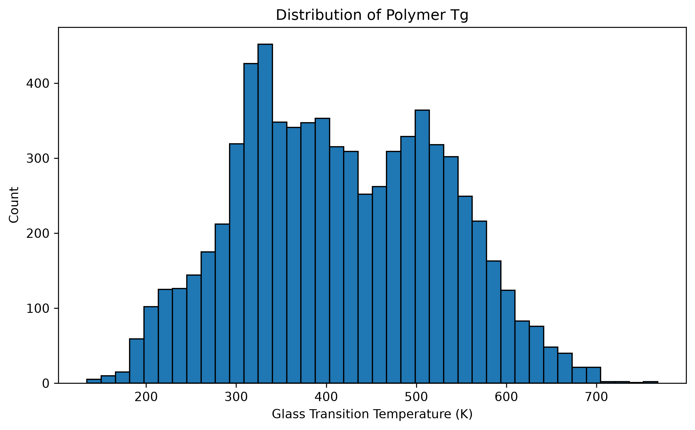

数据覆盖较宽的 Tg 区间，可以用于学习不同聚合物结构与热性能之间的关系。

### Polymer Class Distribution

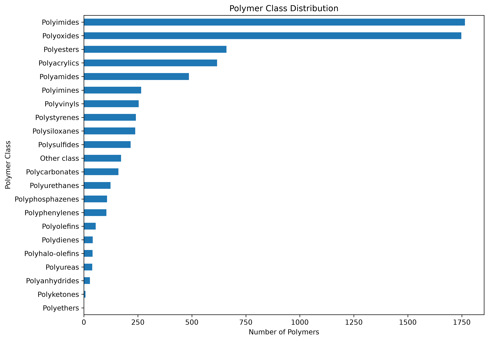

数据集中主要包括 Polyimides、Polyoxides、Polyesters、Polyacrylics、Polyamides 等多个聚合物类别。

---

## 3. Baseline Models

首先比较 Linear Regression、Random Forest 和 XGBoost：

| Model | Test R² | MAE (K) | RMSE (K) |
|---|---:|---:|---:|
| Linear Regression | 0.7688 | 40.28 | 54.09 |
| Random Forest | 0.8729 | 27.41 | 40.10 |
| XGBoost | 0.8835 | 25.86 | 38.40 |

树模型明显优于线性模型，说明聚合物结构描述符与 Tg 之间存在较强的非线性关系。

经过超参数优化后：

```text
Train R² = 0.9903
Test R²  = 0.8878
MAE      = 25.16 K
RMSE     = 37.69 K
```

### Experimental vs Predicted Tg

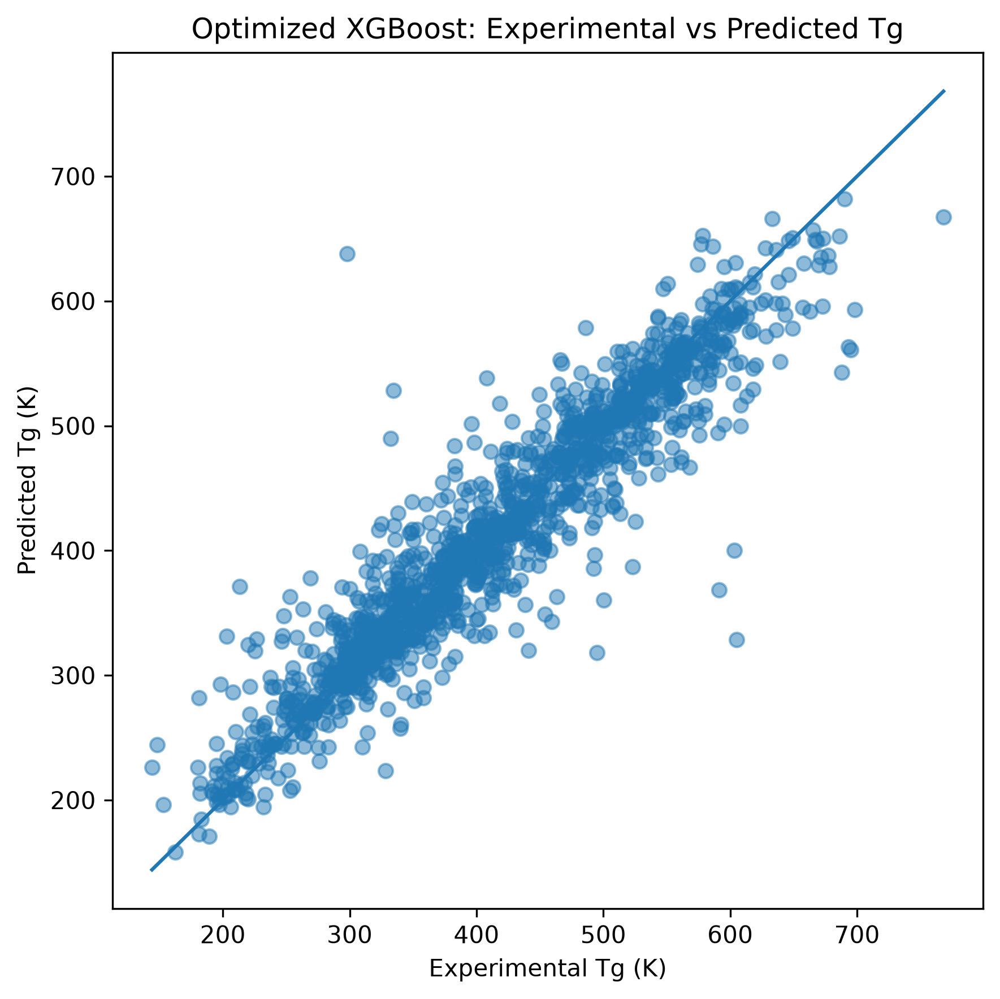

模型预测值整体较好地沿实验值对角线分布，但在部分高 Tg / 低 Tg 区域仍存在较大预测误差。

---

## 4. Cross Validation

使用 5-Fold Cross Validation 检查模型稳定性：

```text
R²   = 0.8846 ± 0.0110
MAE  = 26.15 ± 1.02 K
RMSE = 38.25 ± 2.02 K
```

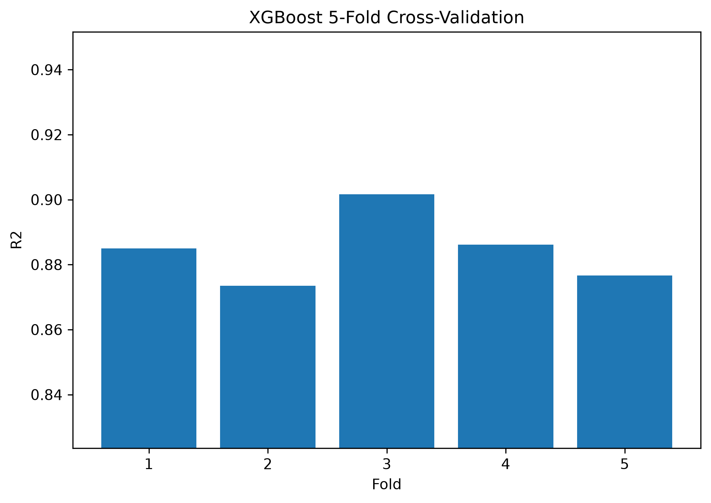

不同 Fold 的 R² 波动较小，说明模型结果并不是由某一次随机 Train/Test Split 偶然产生。

---

## 5. SHAP Explainability

为了分析模型学习到的结构–性能关系，使用 SHAP 对 XGBoost 进行解释。

### SHAP Feature Importance

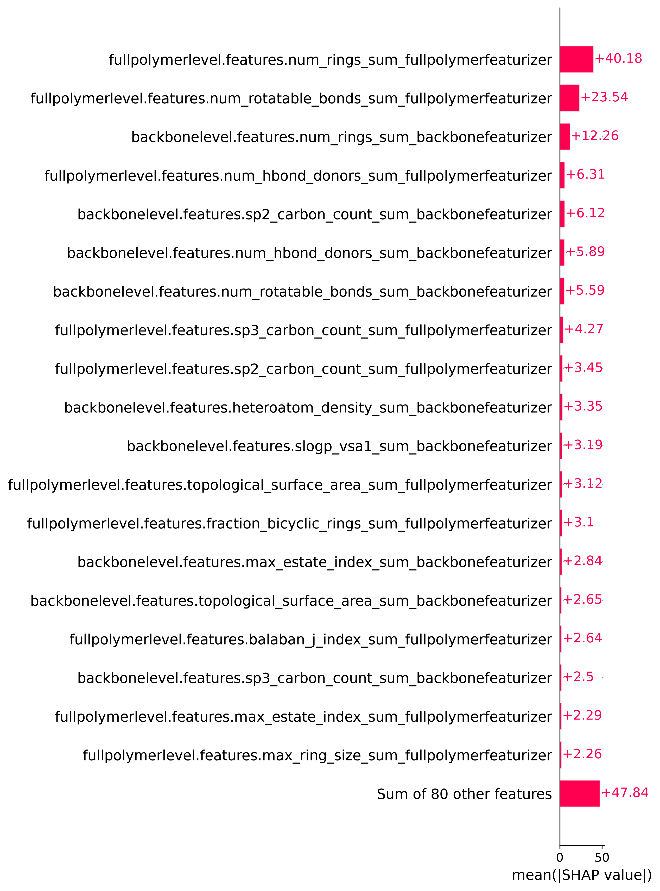

模型最重要的特征包括：

1. Full Polymer Ring Count
2. Full Polymer Rotatable Bonds
3. Backbone Ring Count
4. H-bond Donors
5. Backbone sp2 Carbon Count

其中：

```text
Full Polymer Ring Count
Mean |SHAP| = 40.18 K
```

为最重要的结构描述符。

### SHAP Beeswarm

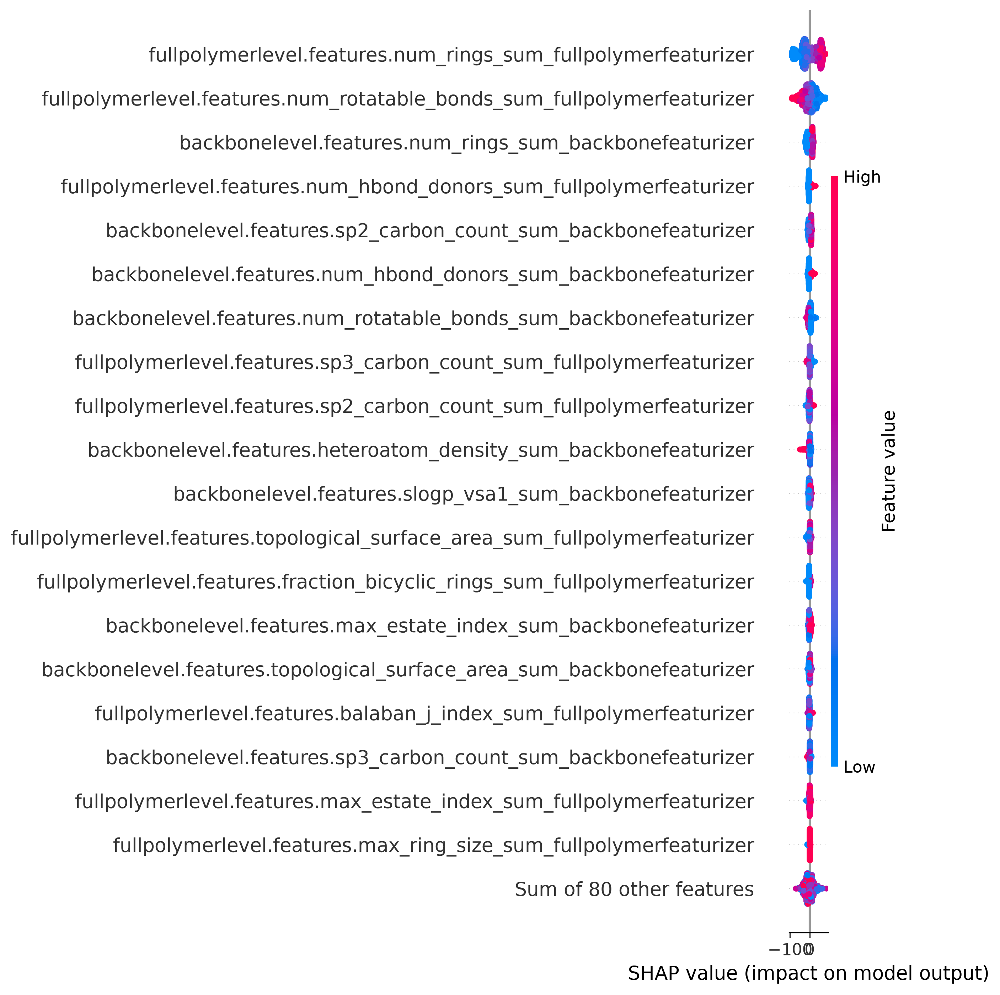

Beeswarm 图进一步展示了不同特征值对 Tg 预测方向的影响。

---

## 6. Structure–Property Relationship

### Ring Count

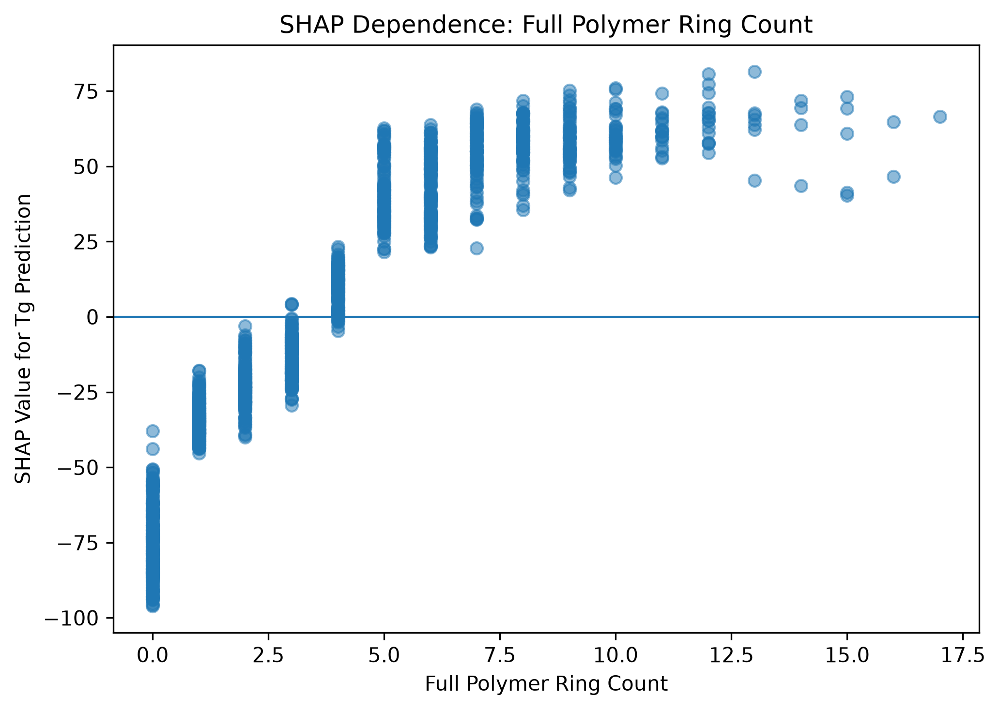

随着聚合物环结构数量增加，SHAP contribution 整体逐渐由负转正。

模型学习到的规律可以概括为：

```text
Ring Structure ↑
      ↓
Chain Rigidity ↑
      ↓
Segmental Mobility ↓
      ↓
Tg ↑
```

说明刚性环结构是影响 Tg 的重要因素。

### Rotatable Bonds

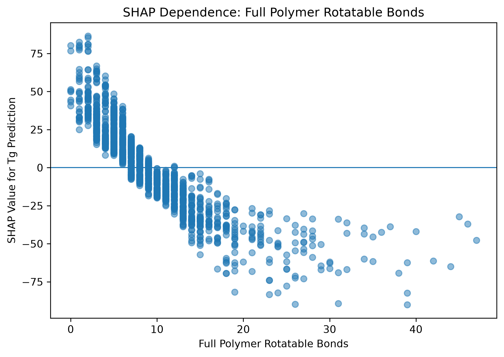

Rotatable Bonds 则呈现相反的整体趋势：

```text
Rotatable Bonds ↑
       ↓
Chain Flexibility ↑
       ↓
Segmental Mobility ↑
       ↓
Tg ↓
```

因此，模型学习到的主要结构控制因素可以理解为：

> **聚合物链刚性与链柔性之间的竞争。**

---

## 7. Structure-Aware Validation

Random Split 可能使结构高度相似的聚合物分别进入 Train 和 Test，从而高估模型面对新材料时的实际泛化能力。

因此，本项目使用：

```text
PSMILES
   ↓
Morgan Fingerprint
   ↓
Butina Clustering
   ↓
Cluster-based Train/Test Split
```

得到：

```text
Structural clusters: 2208
Largest cluster: 198
Median cluster size: 1
```

模型结果：

| Split | R² | MAE (K) |
|---|---:|---:|
| Random Split | **0.8878** | **25.16** |
| Cluster-based Split | 0.8579 | 30.79 |

说明随着 Train/Test 的结构独立性提高，预测难度增加。

---

## 8. Applicability Domain

进一步计算每一个 Test Polymer 与训练集中最相似结构的：

```text
Maximum Tanimoto Similarity
```

测试集结构相似度分布：

```text
Mean   = 0.620
Median = 0.600
Min    = 0.263
Max    = 0.987
```

### Test-to-Train Structural Similarity

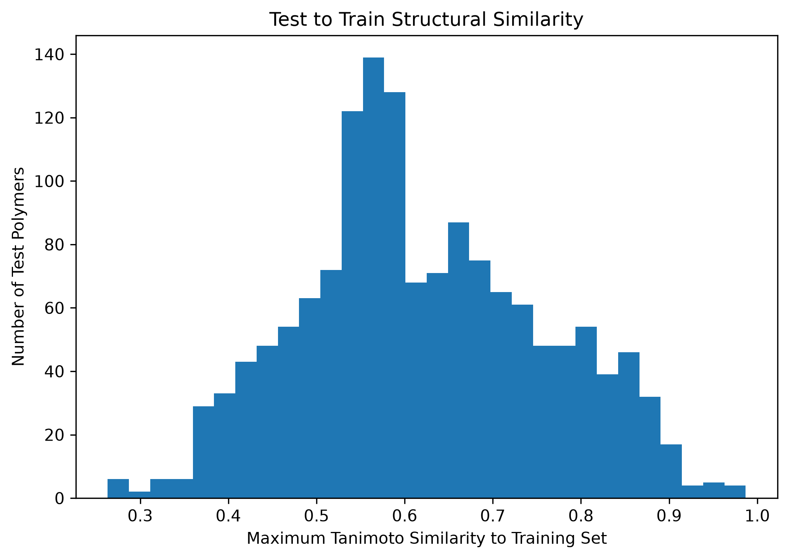

不同结构相似度区域的预测表现：

| Similarity | Samples | R² | MAE (K) |
|---|---:|---:|---:|
| < 0.50 | 261 | 0.7039 | 37.72 |
| 0.50–0.60 | 476 | 0.8552 | 31.02 |
| 0.60–0.70 | 321 | 0.8458 | 31.68 |
| 0.70–0.80 | 223 | 0.8742 | 27.29 |
| ≥ 0.80 | 194 | **0.9129** | **23.42** |

---

## 9. Similarity vs Prediction Error

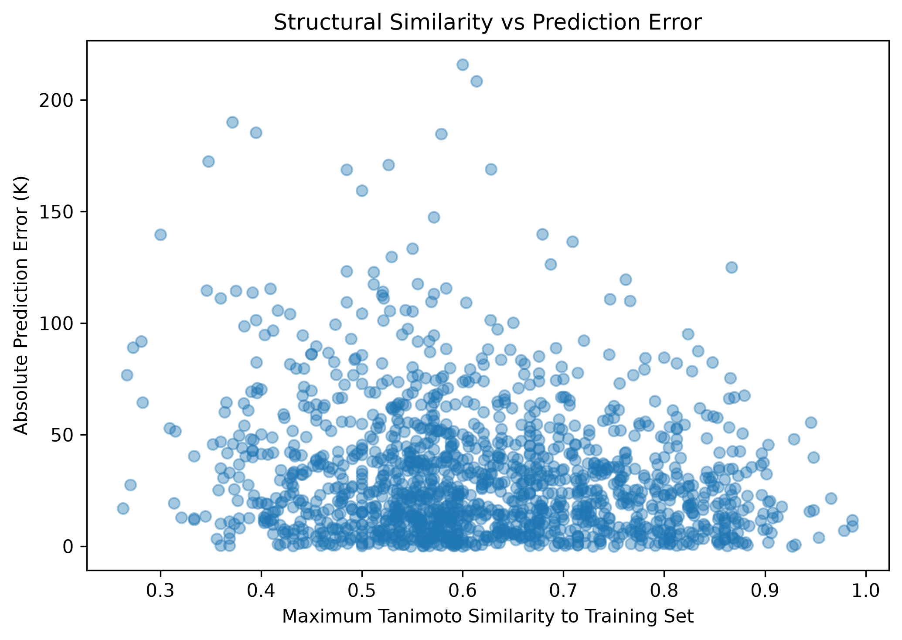

结构相似度与绝对预测误差之间表现出统计显著的负相关：

```text
Pearson r  = -0.1581
Spearman ρ = -0.1182
```

这说明：

> 聚合物越远离模型训练过的化学空间，预测风险整体上越高。

但相关性并不是非常强，因此结构相似度只能作为 Applicability Domain 指标之一，而不能被理解成完整的预测不确定性。

---

## 10. OOD Performance

随着结构相似度进一步下降，模型性能明显恶化：

| Evaluation | R² | MAE (K) |
|---|---:|---:|
| Random Split | 0.8878 | 25.16 |
| Cluster Split | 0.8579 | 30.79 |
| Tanimoto < 0.60 | 0.8134 | 33.39 |
| Tanimoto < 0.50 | 0.7039 | 37.72 |
| Tanimoto < 0.40 | **0.6012** | **50.88** |

### R² vs Chemical-Space Difficulty

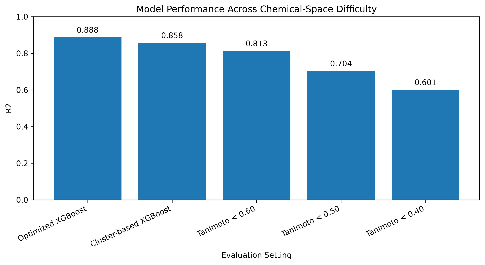

### MAE vs Chemical-Space Difficulty

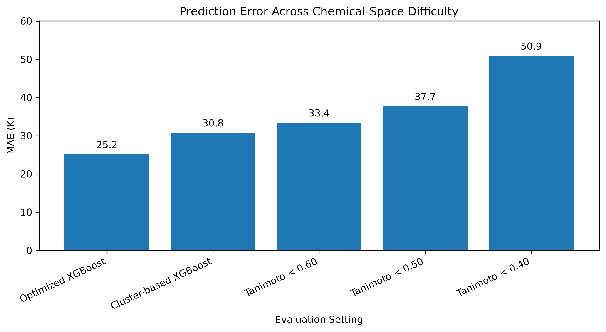

可以看到：

```text
Chemical-space distance ↑

R²
0.8878
↓
0.8579
↓
0.8134
↓
0.7039
↓
0.6012
```

同时：

```text
MAE
25.16 K
↓
30.79 K
↓
33.39 K
↓
37.72 K
↓
50.88 K
```

这是本项目最重要的结果之一：

> **Random Split 下较高的模型精度，并不代表模型对结构新颖聚合物仍具有同等预测能力。**

---

## 11. Prediction Reliability Case Study

基于 Maximum Tanimoto Similarity，将预测简单划分为：

```text
≥ 0.80       High
0.60–0.80    Medium
0.50–0.60    Low
< 0.50       OOD Warning
```

三个代表案例：

| Reliability | Similarity | Experimental Tg | Predicted Tg | Error |
|---|---:|---:|---:|---:|
| High | 0.85 | 389.15 K | 395.40 K | 6.25 K |
| Medium | 0.70 | 536.15 K | 534.81 K | 1.34 K |
| OOD Warning | 0.40 | 346.15 K | 326.51 K | 19.64 K |

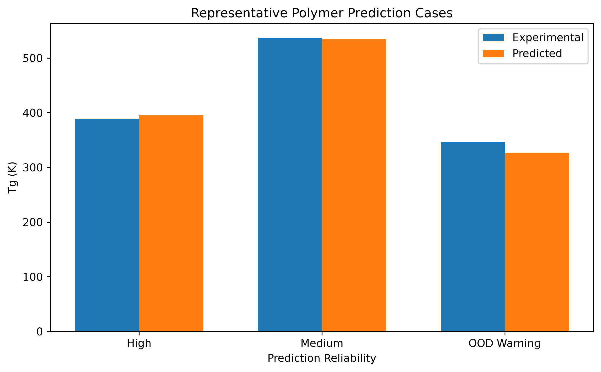

这里需要注意：

> Reliability 表示总体预测风险水平，并不意味着 High 样本的单个预测误差一定小于 Medium 样本。

真正的 Applicability Domain 结论来自全部测试集上的统计结果，而不是三个单独案例。

---

## 12. Key Findings

本项目得到以下主要结论：

**1. XGBoost 能够较好预测聚合物 Tg**

```text
R² = 0.8878
MAE = 25.16 K
```

**2. 聚合物结构–Tg关系具有明显非线性**

Random Forest 和 XGBoost 均明显优于 Linear Regression。

**3. SHAP 捕捉到了具有材料意义的结构因素**

主要包括：

```text
Ring Count
Rotatable Bonds
Backbone Rings
sp2 Carbon
Hydrogen Bond Features
```

**4. Random Split 会一定程度高估模型的结构泛化能力**

```text
Random R²  = 0.8878
Cluster R² = 0.8579
```

**5. 模型远离训练化学空间后性能明显下降**

```text
Tanimoto < 0.40

R²  = 0.6012
MAE = 50.88 K
```

因此，本项目关注的不只是：

> “模型预测是多少？”

还包括：

> **“模型为什么这样预测，以及这个预测是否处于可信化学空间？”**

---

## 13. Project Structure

```text
polymer_tg/
│
├── README.md
├── requirements.txt
│
├── data/
│   ├── raw/
│   ├── processed/
│   ├── model/
│   └── structure_split/
│
├── src/
│   ├── 01_data_cleaning.py
│   ├── 02_feature_audit_eda.py
│   ├── 03_prepare_model_data.py
│   ├── 04_baseline_models.py
│   ├── 05_xgboost_optimization.py
│   ├── 06_cross_validation.py
│   ├── 07_shap_global.py
│   ├── 08_shap_dependence.py
│   ├── 09_structure_aware_split.py
│   ├── 09b_structure_split_audit.py
│   ├── 10_structure_split_model.py
│   ├── 11_similarity_ood_analysis.py
│   ├── 12_predict_new_polymer.py
│   ├── 12b_select_prediction_cases.py
│   └── 13_project_summary.py
│
├── models/
│
└── results/
    ├── figures/
    └── tables/
```

---

## 14. Limitations

当前模型使用数据集中预先计算好的 99 个 molecular descriptors，因此目前尚未完整实现：

```text
任意外部 PSMILES
        ↓
Descriptor Generation
        ↓
XGBoost
        ↓
Tg Prediction
```

此外，Tanimoto Similarity 是一种化学空间距离指标，并不等同于严格的 prediction uncertainty。

后续可以进一步加入：

```text
Conformal Prediction
Ensemble Uncertainty
Automated Descriptor Generation
Graph Neural Networks
Active Learning
```

---

## 15. Summary

本项目完成了：

```text
Polymer Structure
        ↓
Tg Prediction
        ↓
XGBoost
        ↓
SHAP Interpretation
        ↓
Structure-Aware Validation
        ↓
Applicability Domain
        ↓
OOD Reliability Analysis
```

最终结果：

```text
7367 polymers
99 molecular descriptors

Optimized XGBoost
R² = 0.8878
MAE = 25.16 K

Cluster-based
R² = 0.8579

Tanimoto < 0.40
R² = 0.6012
MAE = 50.88 K
```

项目核心观点：

> **一个真正用于材料研发的机器学习模型，不仅需要给出预测结果，还需要说明预测依据和模型适用边界。**